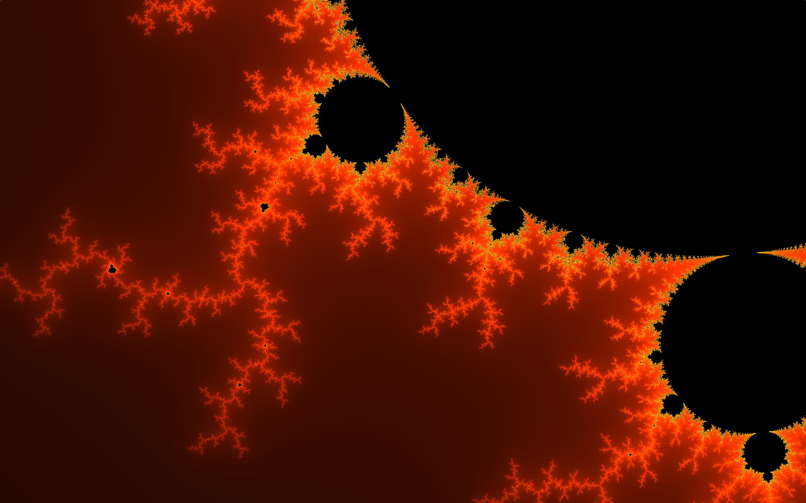
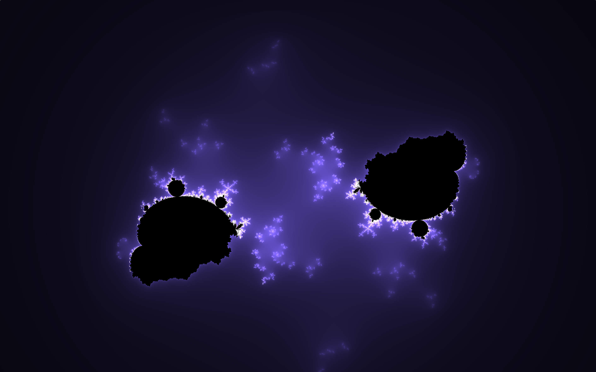
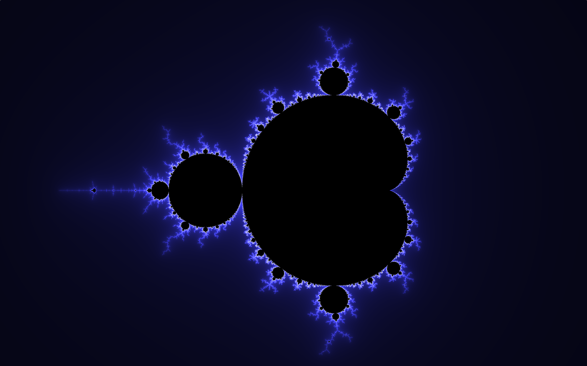

# Mandelbrot Fractal Viewer

A real-time Mandelbrot fractal viewer built with **React** and **GLSL**, using the GPU for faster rendering

### Demo
Deployed to GitHub Pages here:  
[https://biancaivanova.github.io/Mandelbrot-Demo/](https://biancaivanova.github.io/Mandelbrot-Demo/)

### Features
- Real-time GPU rendering using GLSL
- Smooth color shading using a double-log formula for better gradient transitions
- Built with React and WebGL

### Example Renders

  
*Zoomed-in detail, orange shading*

  
*Modified, 'broken' formula for the Mandelbrot set*

*Basic Mandelbrot view*

### TODO
- Add interactive zoom
- Add UI toggles to control fractal viewer settings